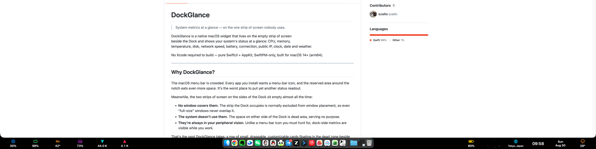

# DockGlance

> System metrics at a glance — on the one strip of screen nobody uses.

DockGlance is a native macOS widget that lives on the empty strip of screen  
beside the Dock and shows your system's status at a glance: CPU, memory,  
temperature, disk, network speed, battery, connection, public IP,
clock, date and weather.

No Xcode required to build — pure SwiftUI + AppKit, SwiftPM-only, built for
macOS 14+ (arm64).

## Screenshots



---

## Why DockGlance?

The macOS menu bar is crowded. Every app you install wants a menu-bar icon,
and the reserved area around the notch eats even more space. It's the worst
place to put yet another status readout.

Meanwhile, the two strips of screen on the sides of the Dock sit empty
almost all the time:

- **No window covers them.** The strip the Dock occupies is normally
excluded from window placement, so even "full-size" windows never
overlap it.
- **The system doesn't use them.** The space on either side of the Dock
is dead area, serving no purpose.
- **They're always in your peripheral vision.** Unlike a menu-bar icon you
must hunt for, dock-side metrics are visible while you work.

That's the spot DockGlance takes: a row of small, draggable, customizable
cards floating in the dead zone beside the Dock.

> **⚠️ Auto-hide caveat:** DockGlance works best when the Dock is **always
> visible**. If you enable *Automatically hide and show the Dock*, the Dock
> slides out of the same strip DockGlance occupies — covering the cards
> whenever it appears, and fighting your mouse when you reach for the edge.
> Keeping the Dock pinned is the intended setup.

---

## Features


| Card              | Shows                                                  |
| ----------------- | ------------------------------------------------------ |
| CPU               | Utilization % (all cores, 1 s window), top CPU process |
| Memory            | Used / total, top memory process                       |
| Temperature       | CPU temperature (or thermal state on Apple Silicon)    |
| Disk              | Root volume usage                                      |
| Download / Upload | Live network speeds (physical interfaces only)         |
| Battery           | Charge level, charging state                           |
| Connection        | Wi-Fi SSID + band, or wired Ethernet                   |
| Public IP         | Current public IP + country                            |
| Time              | HH:MM, 1 s tick                                        |
| Date              | Localized date, e.g. Sat, Aug 8                        |
| Weather           | Current conditions + temperature for your location     |


Every card can be individually configured in **Settings** — shown or
hidden, reordered, and placed on the left or right. Cards fill the strip
from both ends along the screen edge; when they would collide with the
Dock icons, the remaining cards continue from the right side of the Dock.

Additional flourishes:

- **Hover pop-ups** — detailed panels for CPU, memory, battery, weather,
time (a monthly calendar), disk, network, connection (paired Bluetooth
devices) and temperature (2-minute trend sparkline with min/max level
lines and fan state).
- **Profiles** — save and restore complete card configurations (cards,
sizes, colors, offsets) and switch between them from the menu; profiles
also record which display they were made on and are re-applied
automatically when that display is reconnected.
- **Settings window** — card size, spacing from the Dock, background
opacity, text/background colors, language (English / 中文),
temperature unit (°C / °F).
- **Start at Login** — registers via `SMAppService`, visible in System
Settings → General → Login Items.

---

## Install

### Option A — Direct download

Grab `DockGlance-<version>.zip` from the
[latest release](https://github.com/icrefin/DockGlance/releases), unzip,
and drag `DockGlance.app` into `/Applications`.

The app is ad-hoc signed (not notarized), so the first launch may trigger
Gatekeeper. Right-click → **Open** once, or clear the quarantine flag:

```sh
xattr -dr com.apple.quarantine /Applications/DockGlance.app
```

### Option B — Homebrew

```sh
brew tap icrefin/dockglance https://github.com/icrefin/DockGlance.git
brew install --cask dockglance
```

DockGlance runs as a background agent (`LSUIElement`) — no Dock icon and no
menu-bar window of its own, just the widget and a small menu-bar icon for
its menu.

**Uninstall:**

```sh
pkill -x DockGlance
rm -rf /Applications/DockGlance.app
```

---

## Permissions


| Permission    | Why                                                     | When                                                                                           |
| ------------- | ------------------------------------------------------- | ---------------------------------------------------------------------------------------------- |
| Accessibility | Measures the Dock's icon-bar extent on macOS 26+        | Asked once; without it, cards use a conservative central zone (safe, just less tightly packed) |
| Location      | Weather for your current location (Open-Meteo, keyless) | Asked once; weather card degrades to `—` if denied                                             |


The app is **not sandboxed** — a sandbox would block the `sysctl`/Mach
reads used for CPU/memory/temperature metrics.

---

# DockGlance

> 在没人用的屏幕角落，一眼看清系统的全部状态。

DockGlance 是一款原生 macOS 小组件：它驻留在 Dock 两侧未被使用的屏幕
条带上，实时显示 CPU、内存、温度、磁盘、网速、电池、网络连接、
公网 IP、时钟、日期与天气。

纯 SwiftUI + AppKit，仅依赖 SwiftPM（无需 Xcode 即可构建），面向
macOS 14+（arm64）编译。

## 为什么做这个 App？

macOS 菜单栏太挤了。每装一个应用都想往菜单栏塞图标，"刘海"两侧的保留
区又进一步压缩空间——这绝对是放状态信息最差的地方。

而 Dock 两侧的屏幕条带几乎永远空着：

- **窗口盖不到它。** Dock 占据的条带通常被系统排除在窗口布局之外，所谓"满屏窗口"不会盖住它。 
- **系统不利用它。** Dock 两侧是死区，没什么用处。
- **它始终在你的余光里。** 菜单栏图标要专门去找，而 Dock 旁边的指标在工作时抬眼就能看到。

这正是 DockGlance 的位置：一行小巧、可拖动、可自定义的卡片，悬浮在  
Dock 旁边的空白条带上。

> **⚠️ 自动隐藏 Dock 的注意事项：** DockGlance 的最佳使用方式是保持Dock **始终显示**。如果开启了"自动隐藏和显示程序坞”，窗口放大会盖住卡片，你伸手去屏幕边缘时还会和鼠标操作互相打架。请保持 Dock 固定显示。

## 功能


| 卡片      | 显示内容                          |
| ------- | ----------------------------- |
| CPU     | 使用率（全体核心，1 秒窗口）、占用最高的进程       |
| 内存      | 已用 / 总量、占用最高的进程               |
| 温度      | CPU 温度（Apple Silicon 上回退为热状态） |
| 磁盘      | 根卷使用情况                        |
| 下载 / 上传 | 实时网速（仅物理网卡）                   |
| 电池      | 电量、充电状态                       |
| 连接      | Wi-Fi 名称 + 频段，或以太网，蓝牙设备       |
| 公网 IP   | 当前公网 IP + 所属国家                |
| 时间      | 时:分，每秒跳动                      |
| 日期      | 本地化日期                         |
| 天气      | 当前位置的天气与温度                    |


每张卡片都可在设置中单独设置显示/隐藏，排列顺序，左或右。卡片在左右两端沿屏幕边缘开始排列；  
遇到 Dock 图标时，剩余的卡片继续从 Dock 右侧排起。

其他亮点：

- **悬停弹窗**——CPU、内存、电池、天气、时间（月历）、磁盘、网络、
连接（已配对蓝牙设备）、温度（带最小/最大参考线的 2 分钟趋势迷你
图 + 风扇状态）均有详细面板。
- **配置（Profiles）**——保存/恢复整套卡片配置（卡片、尺寸、颜色、
偏移），可从菜单一键切换；配置还会记录创建时所处的显示器，当该
显示器重新接入时自动套用。
- **设置窗口**——卡片尺寸、与 Dock 的间距、背景透明度、文字/背景
颜色、界面语言（English / 中文）、温度单位（°C / °F）。
- **开机启动**——通过 `SMAppService` 注册，可在 系统设置 → 通用 →
登录项 中查看。

## 安装

### 方式一：直接下载

从[最新发布页](https://github.com/icrefin/DockGlance/releases)下载
`DockGlance-<version>.zip`，解压后把 `DockGlance.app` 拖入
`/Applications`。

应用为 ad-hoc 签名（未公证），首次启动可能触发 Gatekeeper。右键 →
**打开**一次，或执行：

```sh
xattr -dr com.apple.quarantine /Applications/DockGlance.app
```

### 方式二：Homebrew

```sh
brew tap icrefin/dockglance https://github.com/icrefin/DockGlance.git
brew install --cask dockglance
```

DockGlance 以后台代理方式运行（`LSUIElement`）——没有 Dock 图标，也
没有自己的菜单栏窗口，只有一行小组件和一个小菜单栏图标。

**卸载：**

```sh
pkill -x DockGlance
rm -rf /Applications/DockGlance.app
```

## 权限


| 权限   | 用途                        | 时机                              |
| ---- | ------------------------- | ------------------------------- |
| 辅助功能 | macOS 26+ 下测量 Dock 图标区域范围 | 首次询问；未授权时卡片使用保守的中央区域（安全，只是不够紧凑） |
| 位置   | 获取当前位置天气（Open-Meteo，无需密钥） | 首次询问；拒绝后天气卡片显示 `—`              |


应用**未沙盒化**——沙盒会阻止读取 CPU/内存/温度指标所需的
`sysctl`/Mach 接口。